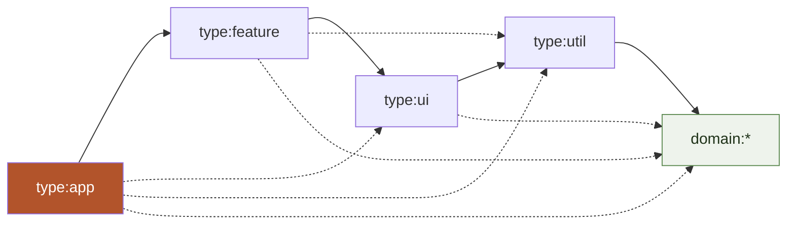
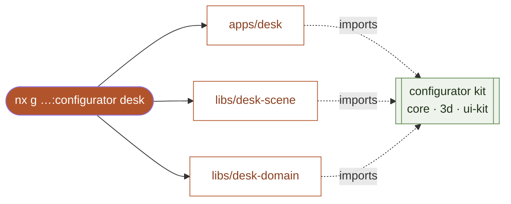

<div align="center">

# nxGenerator

**An ecosystem of parametric 3D configurators, built on an Nx monorepo.**

One application — *Stairgen* — decomposed into a shared configurator kit,
so that the next configurator is a single command away.

[](https://github.com/przemeknowak781/nxGenerator/actions/workflows/ci.yml)
&nbsp;·&nbsp;
Nx&nbsp;23&nbsp;·&nbsp;React&nbsp;19&nbsp;·&nbsp;Vite&nbsp;8&nbsp;·&nbsp;React&nbsp;Three&nbsp;Fiber&nbsp;·&nbsp;TypeScript&nbsp;strict

**Live demo:** [stairgen](https://przemeknowak781.github.io/nxGenerator/stairgen/)
· [taras](https://przemeknowak781.github.io/nxGenerator/taras/)
· [planter](https://przemeknowak781.github.io/nxGenerator/planter/)
— or the [landing page](https://przemeknowak781.github.io/nxGenerator/)

</div>

<br/>

The app is a thin composition root. Everything it renders — the parametric
engine, the 3D scene, export, validation, the UI shell — Nx wires together from
libraries into one graph and serves with a single command.

```bash
npx nx serve @nxgen/stairgen
```

<div align="center">· · ·</div>

## How Nx runs the app

`apps/stairgen` imports nothing but `@nxgen/*` packages. Nx maintains a
dependency graph derived from those imports, resolves them to library source —
no build step in between — and hands the whole graph to Vite.


What the monorepo buys the app, beyond a plain folder of code:

| Nx mechanism | Effect on the app |
|---|---|
| Source graph from `@nxgen/*` imports | `nx serve` boots the app with live libraries — HMR works across package boundaries |
| Package exports resolved to source | No "build the library, then the app" step; Vite bundles the whole graph at once |
| TS project references | `nx typecheck` checks types in dependency order, incrementally |
| Task graph with `dependsOn` | `build`, `test` and `typecheck` run in the correct order |

<div align="center">· · ·</div>

## Module boundaries

Every project carries a `scope:*` (product) and a `type:*` (layer) tag. The
[`@nx/enforce-module-boundaries`](eslint.config.mjs) rule fails `nx lint` the
moment a dependency crosses a line it shouldn't.



| Layer | may depend on | | Scope | may depend on |
|---|---|---|---|---|
| `type:app` | all lower layers | | `shared` | only `shared` |
| `type:feature` | ui, util, domain:* | | `stair` | stair, shared |
| `type:ui` | util, domain:* | | `taras` | taras, shared |
| `type:util` | domain:* | | `planter` | planter, shared |
| `domain:*` | domain:* | | | |

Each domain library carries its own `domain:<product>` tag — `domain:stair`,
`domain:taras`, `domain:planter` — plus the shared engine, `domain:core`.

The shared `configurator-*` libraries cannot depend on the stairs, and no
configurator can reach into another's code. A violation turns CI red:

```
error  A project tagged "scope:shared" can only depend on libs tagged "scope:shared"
       @nx/enforce-module-boundaries
```

<div align="center">· · ·</div>

## A new configurator, in one command

The heart of the ecosystem is a custom Nx generator, `configurator-plugin`. It
composes the official `@nx/js` and `@nx/react` generators and overlays templates
to produce a complete, immediately runnable configurator wired to the kit.

```bash
npx nx g @nxgen/configurator-plugin:configurator desk \
  --displayName "Desk" --description "3D desk configurator"
```



This is exactly how `apps/planter` and `apps/taras` came to be — the proof of
reuse. You supply the product's geometry and parameters; the canvas, camera,
HDRI, shadows, GLB export, UI chrome and validation all arrive from the
libraries.

See **[Creating a configurator](docs/creating-a-configurator.md)** for the full
walkthrough — the three files you own, worked through the wooden-deck example.

<div align="center">· · ·</div>

## Affected builds and caching

The same graph drives scaling. A change in `stair-domain` runs only the stair
chain — `planter` and the shared kit are left untouched.

```bash
$ nx affected -t build --files=libs/stair-domain/src/lib/metrics.ts
   stair-domain    stair-geometry
   stair-scene     stairgen
   (planter, ui-kit, configurator-* — skipped)
```

Running the same task again is a cache hit. CI
([`ci.yml`](.github/workflows/ci.yml)) uses `nx affected`, so a pull request
only builds what changed and its dependents.

<div align="center">· · ·</div>

## Layout

```
apps/
  stairgen/            spiral-stair configurator (WT §68, GLB export)
  taras/               wooden-deck configurator      — produced by the generator
  planter/             wooden-planter configurator   — produced by the generator
libs/
  configurator-core/   scope:shared   domain:core   store factory, presets, validation engine
  configurator-3d/     scope:shared   type:ui        R3F: canvas, camera, HDRI, GLB export, materials
  ui-kit/              scope:shared   type:ui        UI chrome, Leva theme, shell CSS
  stair-domain/        scope:stair    domain:stair   types, defaults, presets, metrics, WT §68 rules
  stair-geometry/      scope:stair    type:util      three.js geometry builders
  stair-scene/         scope:stair    type:feature   R3F components (StairModel …)
  taras-domain/ …      scope:taras    domain:taras   (+ taras-scene)
  planter-domain/ …    scope:planter  domain:planter (+ planter-scene)
tools/
  configurator-plugin/ scope:tooling  type:plugin    Nx plugin with the configurator generator
```

## Commands

```bash
npm install                                   # install (npm workspaces)
npx nx serve  @nxgen/stairgen                 # dev server, HMR across libraries
npx nx graph                                  # interactive project graph
npx nx run-many -t lint test build typecheck  # everything, cached
npx nx affected -t lint test build            # only what a change touched
npx nx g @nxgen/configurator-plugin:configurator <name>   # scaffold a configurator
```

## Stack

Nx 23 (integrated monorepo, TS project references) · React 19 · Vite 8 ·
Vitest · React Three Fiber 9 and three.js · Leva · Zustand · TypeScript (strict).

<div align="center">
<br/>
<sub>Stairgen — a configurator for concrete, timber and steel spiral stairs with a
continuous soffit, validated live against Polish building code (Warunki
Techniczne §68), exporting to glTF 2.0 with PBR materials and round-trip config.</sub>
</div>
