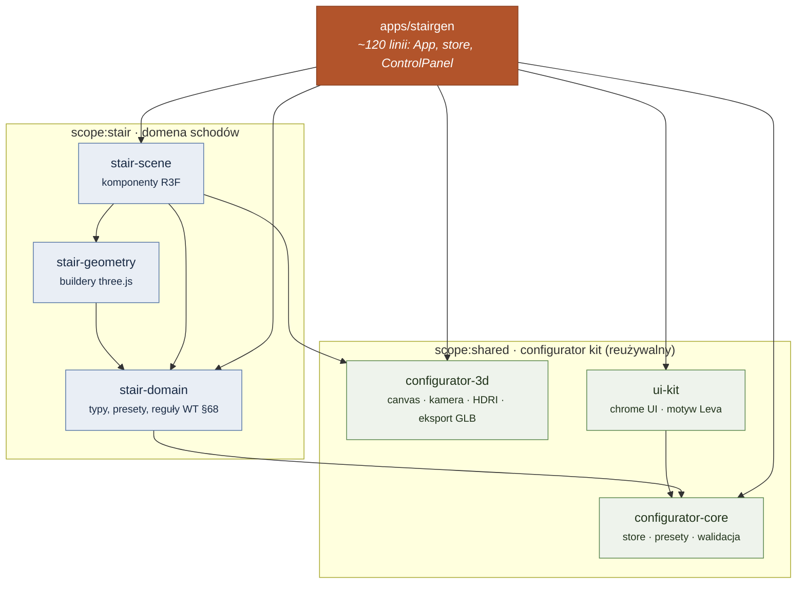
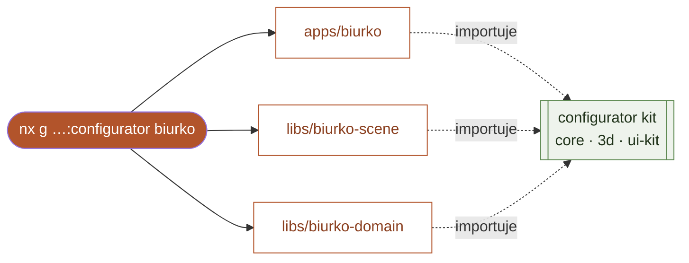

<div align="center">

# ⬢ nxGenerator

### Ekosystem parametrycznych konfiguratorów 3D zbudowany na monorepo **Nx**

Jedna aplikacja (*Stairgen*) rozłożona na współdzielony **configurator kit** —
dzięki czemu **kolejny konfigurator powstaje jednym poleceniem**.

[](https://github.com/przemeknowak781/nxGenerator/actions/workflows/ci.yml)


</div>

---

## 💡 Idea w jednym zdaniu

> **Aplikacja to tylko „composition root".** Całą jej treść — silnik parametryczny,
> scenę 3D, eksport, walidację, chrome UI — **Nx skleja z bibliotek** w jeden
> graf i uruchamia jednym poleceniem.

```bash
npx nx serve @nxgen/stairgen      # ← i cała aplikacja żyje
```

---

## 🧩 Jak Nx uruchamia aplikację

`apps/stairgen` importuje tylko pakiety `@nxgen/*`. Nx trzyma **graf zależności**
wyprowadzony z tych importów, rozwiązuje je do **źródła** bibliotek (bez kroku
budowania między nimi) i podaje cały graf do Vite:



Co daje tu Nx (a czego nie dałby zwykły folder z kodem):

| Mechanizm Nx | Efekt dla aplikacji |
|---|---|
| **Source graph** z importów `@nxgen/*` | `nx serve` startuje apkę z **żywymi** bibliotekami — HMR działa przez granice pakietów |
| **Package exports → źródło** | Zero kroku „zbuduj bibliotekę, potem apkę"; Vite bundluje cały graf naraz |
| **TS project references** | `nx typecheck` sprawdza typy w poprawnej kolejności, przyrostowo |
| **Task graph + `dependsOn`** | `build`/`test`/`typecheck` uruchamiają się we właściwej kolejności zależności |

---

## 🛡️ Granice modułów — Nx pilnuje architektury

Każdy projekt ma tagi `scope:*` (produkt) i `type:*` (warstwa). Reguła
[`@nx/enforce-module-boundaries`](eslint.config.mjs) **wywala `nx lint`**, gdy
ktoś złamie zależności:


| Warstwa | może zależeć od | | Zakres | może zależeć od |
|---|---|---|---|---|
| `app` | wszystkie niższe | | `shared` | **tylko** `shared` |
| `feature` | ui, util, domain | | `stair` | stair, shared |
| `ui` | util, domain | | `planter` | planter, shared |
| `domain` | domain | | | |

➡️ **`configurator-*` (shared) fizycznie nie może zależeć od schodów**, a jeden
konfigurator nie sięgnie do kodu drugiego. Naruszenie = czerwone CI:

```
error  A project tagged "scope:shared" can only depend on libs tagged "scope:shared"
       @nx/enforce-module-boundaries
```

---

## ⚡ Nowy konfigurator jednym poleceniem

Sercem ekosystemu jest **własny generator Nx** (`configurator-plugin`). Komponuje
oficjalne generatory `@nx/js`/`@nx/react` i nakłada szablony, tworząc kompletny,
**działający od razu** konfigurator podpięty pod kit:

```bash
npx nx g @nxgen/configurator-plugin:configurator biurko \
  --displayName "Biurko" --description "Konfigurator biurek 3D"
```



Dokładnie tak powstało **`apps/planter`** — dowód reużywalności. Podmieniasz
geometrię i parametry na właściwe dla produktu; canvas, kamerę, HDRI, cienie,
eksport GLB, chrome UI i walidację dostajesz z bibliotek.

---

## 🚀 Cache i `affected` — Nx robi tylko to, co trzeba

Graf zależności napędza też skalowanie. Zmiana w `stair-domain` uruchamia
**wyłącznie** łańcuch schodów — `planter` i kit nie są ruszane:

```bash
$ nx affected -t build --files=libs/stair-domain/src/lib/metrics.ts
   ✔ @nxgen/stair-domain   @nxgen/stair-geometry
   ✔ @nxgen/stair-scene    @nxgen/stairgen
     (planter, ui-kit, configurator-* — pominięte)
```

Drugie uruchomienie tego samego zadania to **trafienie w cache** (0 ms). CI
([`ci.yml`](.github/workflows/ci.yml)) używa `nx affected`, więc PR liczy tylko
to, co zmienione i ich zależnych.

---

## 🗂️ Struktura

```
apps/
  stairgen/            # konfigurator schodów kręconych (WT §68, eksport GLB)
  planter/             # wygenerowany generatorem — dowód reużywalności
libs/
  configurator-core/   # scope:shared  · store factory, presety, silnik walidacji
  configurator-3d/     # scope:shared  · R3F: canvas, kamera, HDRI, eksport GLB, materiały
  ui-kit/              # scope:shared  · chrome UI, motyw Leva, CSS powłoki
  stair-domain/        # scope:stair   · typy, defaults, presety, metryki, reguły WT §68
  stair-geometry/      # scope:stair   · buildery geometrii three.js
  stair-scene/         # scope:stair   · komponenty R3F (StairModel …)
  configurator-plugin/ # scope:tooling · plugin Nx z generatorem `configurator`
```

## 🛠️ Komendy

```bash
npm install                                   # instalacja (npm workspaces)
npx nx serve  @nxgen/stairgen                 # dev server + HMR przez biblioteki
npx nx graph                                  # interaktywny graf projektów
npx nx run-many -t lint test build typecheck  # cała praca, z cache
npx nx affected -t lint test build            # tylko to, co dotknięte zmianą
npx nx g @nxgen/configurator-plugin:configurator <nazwa>   # nowy konfigurator
```

## 🧱 Stack

**Nx 23** (integrated monorepo, TS project references) · **React 19** ·
**Vite 8** · **Vitest** · **React Three Fiber 9 / three.js** · **Leva** ·
**Zustand** · **TypeScript** (strict).

<div align="center"><sub>Stairgen · konfigurator betonowych / drewnianych / stalowych schodów kręconych z ciągłym podniebieniem, walidowany na żywo wg <i>Warunków Technicznych §68</i>, z eksportem do glTF 2.0 (PBR + round-trip config).</sub></div>
