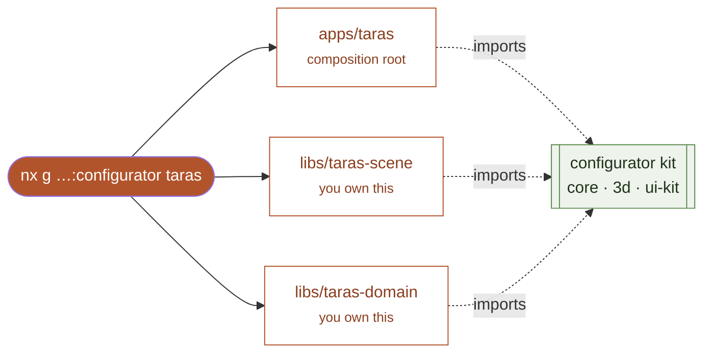

<div align="center">

# Creating a configurator

**From one command to a real product, on the shared pipeline.**

A walkthrough of adding a new configurator to the monorepo — what the generator
gives you, and the three files you make your own. The wooden-deck configurator
(`taras`) is the worked example throughout.

</div>

<br/>

Every configurator is the same shape: a thin app that composes the shared kit,
a domain library (the parametric model and its rules), and a scene library (the
3D form). The generator stamps out that shape, wired and tagged; you fill in the
product.



<div align="center">· · ·</div>

## 1. Generate the skeleton

```bash
npx nx g @nxgen/configurator-plugin:configurator taras \
  --displayName "Taras" --description "Konfigurator tarasów drewnianych"
```

This composes the official `@nx/js` and `@nx/react` generators and overlays the
plugin's templates. What you get, already wired and green:

| Created | Tag | Comes wired |
|---|---|---|
| `apps/taras` | `scope:taras · type:app` | canvas, HDRI, shadows, orbit controls, GLB export, UI chrome, preset picker, live validation panel, Leva control panel |
| `libs/taras-domain` | `scope:taras · domain:taras` | a placeholder config, one preset, one validation rule, a passing spec |
| `libs/taras-scene` | `scope:taras · type:feature` | a placeholder box model driven by the config |

The projects import only `@nxgen/*` packages, so the module-boundary rules apply
from the first commit — `taras` can reach the shared kit and its own libs, and
nothing else. Run it straight away:

```bash
npx nx serve @nxgen/taras
```

<div align="center">· · ·</div>

## 2. The three files you own

Everything product-specific lives in three files. The kit provides the rest.

| File | Your job |
|---|---|
| `libs/taras-domain/src/index.ts` | the config type, defaults, presets, derived metrics, validation rules |
| `libs/taras-scene/src/lib/model.tsx` | turn the config into R3F geometry |
| `apps/taras/src/app/ControlPanel.tsx` | the Leva schema (which parameters, which ranges) |

Plus two small touch-ups in `apps/taras/src/app/App.tsx`: the status-bar
readout and the camera/grid framing for your product's scale.

### The domain — model, metrics, rules

The domain is pure logic with no 3D or React. Define the config, expose any
derived quantities once (so the scene and the validator can never disagree),
and write rules as `Rule<Config>` functions the shared engine runs for you.

```ts
// libs/taras-domain/src/index.ts
export interface TarasConfig {
  deckWidth: number; deckLength: number; deckHeight: number;
  boardWidth: number; boardThickness: number; boardGap: number;
  joistSpacing: number; joistHeight: number;
  color: string; roughness: number; metallic: number;
}

// Derived once — used by BOTH the geometry and the status bar.
export function computeSummary(c: TarasConfig): TarasSummary {
  const boards = Math.max(1, Math.floor((c.deckWidth + c.boardGap) / (c.boardWidth + c.boardGap)));
  const joists = Math.max(2, Math.floor(c.deckLength / c.joistSpacing) + 1);
  return { boards, joists, areaM2: (c.deckWidth * c.deckLength) / 1_000_000 };
}

// A rule returns an Issue or null; runRules collects the ones that fire.
const rules: Rule<TarasConfig>[] = [
  (c) => {
    const maxSpacing = c.boardThickness * 20; // deflection limit
    return c.joistSpacing > maxSpacing
      ? { id: 'joist_spacing', rule: 'joist_spacing_max', severity: 'error',
          field: 'joistSpacing', message: `Rozstaw legarów ${c.joistSpacing} mm > ${maxSpacing} mm.` }
      : null;
  },
];
export const validate = (c: TarasConfig) => runRules(c, rules);
```

Rules that model the real product are what make a configurator trustworthy —
here, joist deflection, board-gap drainage, and structure fitting within the
deck height.

### The scene — config to geometry

The scene is an R3F group that reads a plain config. Derive counts from the same
`computeSummary`, memoize geometry per parameter so nothing rebuilds needlessly,
and build materials with the kit's `buildStandardMaterial`.

```tsx
// libs/taras-scene/src/lib/model.tsx
export function TarasModel({ config, rootName = 'TarasRoot' }: TarasModelProps) {
  const { boards, joists } = computeSummary(config);           // agrees with the validator
  const deckMat = useMemo(() => buildStandardMaterial({ ...config }), [/* material deps */]);
  const boardGeom = useMemo(() => new BoxGeometry(config.boardWidth, config.boardThickness, config.deckLength),
    [config.boardWidth, config.boardThickness, config.deckLength]);
  return (
    <group name={rootName}>
      {boardXs.map((x, i) => (
        <mesh key={i} geometry={boardGeom} material={deckMat} position={[x, boardY, 0]} castShadow receiveShadow />
      ))}
      {/* joists, posts … */}
    </group>
  );
}
```

Two rules of thumb the audit turned into habits:

- **Skip empty geometry.** If an element can be disabled, return `null` rather
  than a mesh with a position-less geometry — a zero-vertex mesh produces NaN
  bounding spheres and junk GLB nodes. Guard with `geom.getAttribute('position')?.count`.
- **One source of truth for counts and placement.** Deriving board/joist counts
  in the domain (not re-deriving them in the scene) is what keeps the drawing
  and the validation in lock-step.

The `name={rootName}` group is what the GLB exporter looks up, so it must match
the `rootName` you pass to `<ExportListener>` in `App.tsx`.

### The app — parameters and framing

`ControlPanel.tsx` is the one place that knows your full parameter surface;
group it into Leva folders with sensible ranges. In `App.tsx`, feed the status
bar from your metrics and frame the camera to your product's size.

```tsx
// apps/taras/src/app/App.tsx
const summary = useMemo(() => computeSummary(cfg), [cfg]);
const statusItems = [
  { k: 'Pow.', v: `${summary.areaM2.toFixed(1)} m²` },
  { k: 'Desek', v: String(summary.boards) },
  { k: 'Legarów', v: String(summary.joists), accent: true },
];
// A 4 m deck needs a wider frame than a 1 m object:
<ConfiguratorCanvas cameraPosition={[5000, 3400, 5200]} controlsTarget={[0, 300, 0]} grid={{ size: 8000, divisions: 40 }}>
```

<div align="center">· · ·</div>

## 3. Verify

```bash
npx nx run-many -t lint test build typecheck   # cached; run for the whole workspace
npx nx graph                                    # confirm your project sits under its own scope
```

Two checks worth making deliberately:

- **Boundaries.** `nx lint` fails if your scene reaches into another product or
  a shared lib depends on yours. The graph should show `taras → kit + taras-*`
  and no edges to `stair` or `planter`. To give the new product cross-product
  isolation, add its scope to `eslint.config.mjs` (the generator sets the tags
  but not the constraint):

  ```js
  { sourceTag: 'scope:taras', onlyDependOnLibsWithTags: ['scope:taras', 'scope:shared'] },
  ```
- **Geometry validity.** Mirror `libs/stair-geometry/src/lib/geometryValidity.spec.ts`:
  for every preset, assert all vertex positions are finite and all indices are
  in range. This is the cheapest guard against a config that silently renders
  garbage or corrupts the GLB.

<div align="center">· · ·</div>

## Checklist

- [ ] `nx g …:configurator <name>` — skeleton serves
- [ ] `domain`: config, presets, `computeSummary`, real validation rules
- [ ] `scene`: geometry from config; counts from the domain; empty elements return `null`; root group named
- [ ] `ControlPanel`: parameters and ranges
- [ ] `App`: status metrics + camera/grid for scale
- [ ] tests: domain rules + a geometry-validity spec
- [ ] `nx run-many -t lint test build typecheck` green; `nx graph` clean

The kit does the 3D plumbing — canvas, camera, HDRI, shadows, GLB export, UI
chrome, the validation engine. You supply the product: its parameters, its form,
and the rules that make it correct.
